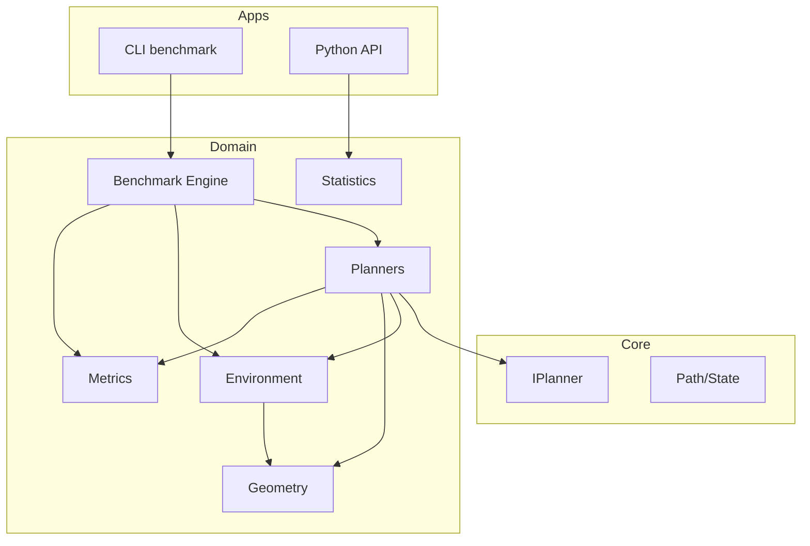
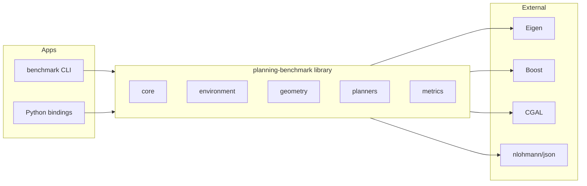

# Архитектура: Planning Benchmark Suite

**Версия:** 1.0  
**Дата:** 2025-02-21  
**ТЗ:** docs/technical_specification.md

---

# 1. Описание задачи

Planning Benchmark Suite — высокопроизводительный C++ фреймворк для реализации и сравнения алгоритмов планирования движения. Покрывает UC-01–UC-11 из ТЗ: grid/sampling-based планировщики, генерация карт, бенчмарки, метрики, воспроизводимость, визуализация, CI.

---

# 2. Функциональная архитектура

## 2.1 Функциональные компоненты

### Компонент: Core (Ядро)

**Назначение:** Базовые типы данных, интерфейсы планировщиков, Path, State, общие утилиты.

**Функции:**
- `IPlanner::solve(Environment, State, State) → Path` — единый интерфейс планировщиков (UC-01, UC-02)
- `Path`, `State` — представление пути и состояния
- `Metrics` — структура для сбора метрик
- Базовые типы и traits для compile-time polymorphism

**Зависимости:** Нет (ядро)  
**Зависит от:** environment, planners, geometry, metrics

---

### Компонент: Environment (Окружение)

**Назначение:** Модели сред и генерация карт.

**Функции:**
- `IEnvironment` — интерфейс окружения (grid, continuous, SE(2))
- `GridEnvironment` — occupancy grid 2D (UC-01)
- `ContinuousEnvironment` — непрерывная 2D (UC-02)
- `SE2Environment` — позиция + ориентация (UC-11)
- `MapGenerator` — детерминированная генерация с seed (UC-03)
- Типы генерации: Random uniform, Perlin, Maze, Narrow passage, Random convex polygons
- JSON-сериализация карт (UC-03)

**Связанные UC:** UC-01, UC-02, UC-03, UC-11

**Зависимости:** core, geometry

---

### Компонент: Geometry (Геометрия и коллизии)

**Назначение:** Collision checking, clearance, геометрические примитивы.

**Функции:**
- Grid: occupancy check, Bresenham line (UC-04)
- Continuous: segment–polygon intersection, clearance computation (UC-04)
- Примитивы: Point2D, Segment2D, Polygon, occupancy grid access

**Связанные UC:** UC-04

**Зависимости:** core  
**Зависит от:** CGAL (опционально) или собственная реализация для простых случаев

---

### Компонент: Planners (Планировщики)

**Назначение:** Реализация алгоритмов планирования.

**Функции:**
- Grid-based: Dijkstra, A*, Weighted A*, Theta* (UC-01)
- Sampling-based: PRM, Lazy PRM, RRT, RRT*, Informed RRT* (UC-02)
- Min-heap для графовых (Boost.Heap или std)
- KD-tree для sampling-based (nanoflann или аналог)
- Admissibility check для A*, rewiring для RRT*, convergence tracking для RRT*
- Configurable step size, goal bias

**Связанные UC:** UC-01, UC-02

**Зависимости:** core, environment, geometry, metrics

---

### Компонент: Metrics (Метрики)

**Назначение:** Сбор и вычисление метрик планирования.

**Функции:**
- Обязательные: path length, computation time (ms), nodes expanded, success rate, memory (UC-05)
- Дополнительные: smoothness (Σ|θ_i − θ_{i−1}|), clearance, energy (∫κ² ds)
- RRT*: cost vs iteration, gap to optimal, log convergence rate (UC-05)

**Связанные UC:** UC-05

**Зависимости:** core

---

### Компонент: Benchmark Engine (Бенчмарк)

**Назначение:** Пакетный запуск экспериментов, статистика, экспорт.

**Функции:**
- CLI: `./benchmark --config config.json` (UC-06)
- Batch runs, 30+ repeats per config
- Параллельное выполнение (OpenMP/TBB)
- mean, std, confidence intervals
- Экспорт CSV, JSON
- Загрузка/сохранение конфигов для воспроизводимости (UC-07)

**Связанные UC:** UC-06, UC-07

**Зависимости:** core, environment, planners, metrics

---

### Компонент: Statistics (Статистический анализ)

**Назначение:** t-test, ANOVA, effect size, визуализация.

**Функции:**
- t-test, ANOVA, effect size (UC-09)
- Boxplots, convergence curves (UC-08, UC-09)
- Контролируемые переменные: map size, obstacle density, narrow passage, dimension, iteration budget

**Связанные UC:** UC-08, UC-09

**Зависимости:** metrics  
**Реализация:** Python API (pybind11) + библиотеки (numpy, scipy, matplotlib) или C++ с экспортом данных

---

## 2.2 Диаграмма функциональных компонентов



---

# 3. Системная архитектура

## 3.1 Архитектурный стиль

**Слоистая архитектура (Layered) + Clean Architecture**

- **Domain (ядро):** IPlanner, State, Path, Environment interfaces, типы
- **Infrastructure:** реализации планировщиков, collision checking, MapGenerator
- **Application:** Benchmark engine, CLI, Python bindings
- **Presentation:** CLI, config files, export formats

**Обоснование:** Research-проект требует чёткого разделения domain/infrastructure для тестируемости, подмены реализаций и соответствия SOLID. Нет распределённых сервисов — достаточно монолитной библиотеки + приложения.

---

## 3.2 Компоненты системы

### Компонент: planning-benchmark (Core library)

**Тип:** C++ static/shared library  
**Назначение:** Ядро фреймворка  
**Реализует:** core, environment, geometry, planners, metrics  
**Технологии:** C++20, CMake, Eigen, Boost, CGAL (geometry), nanoflann (KD-tree)  
**Входящие:** Вызовы из apps  
**Исходящие:** Нет (низкоуровневая библиотека)

---

### Компонент: benchmark (CLI application)

**Тип:** Executable  
**Назначение:** Пакетный запуск бенчмарков  
**Реализует:** Benchmark Engine (UC-06, UC-07)  
**Технологии:** C++20, nlohmann/json, OpenMP/TBB  
**Входящие:** CLI args, config.json  
**Исходящие:** CSV, JSON с результатами

---

### Компонент: pybind11 (Python API)

**Тип:** Python extension module  
**Назначение:** Доступ к планировщикам, окружениям, результатам из Python  
**Реализует:** UC-08, UC-09 (частично)  
**Технологии:** pybind11  
**Входящие:** Python вызовы  
**Исходящие:** Экспорт данных для matplotlib, scipy, pandas

---

### Компонент: Tests

**Тип:** Google Test suites  
**Назначение:** Unit, property-based, regression, performance (UC-10)  
**Технологии:** Google Test

---

## 3.3 Диаграмма компонентов



---

# 4. Модель данных

## 4.1 Концептуальная модель

### Сущность: State

**Описание:** Состояние планировщика (позиция, опционально ориентация).

**Атрибуты:**
- `x, y` (double) — координаты
- `theta` (double, optional) — ориентация для SE(2)
- `grid_index` (int, optional) — для grid-based (row, col)

**Связи:** Используется в Path как вершина пути.

---

### Сущность: Path

**Описание:** Последовательность состояний от start до goal.

**Атрибуты:**
- `states` (vector<State>) — вершины пути
- `length` (double) — длина пути (cache)
- `success` (bool) — найден ли путь

**Связи:** Результат IPlanner::solve.

---

### Сущность: Environment / Grid / Continuous

**Описание:** Модель окружения.

**Атрибуты (Grid):**
- `width, height` (int)
- `occupancy` (2D array или flattened)
- `resolution` (double)

**Атрибуты (Continuous):**
- `obstacles` (vector<Polygon>)
- `bounds` (AABB или bbox)

**Связи:** Вход для IPlanner::solve.

---

### Сущность: ExperimentConfig

**Описание:** Конфигурация одного эксперимента.

**Атрибуты:**
- `environment_config` (JSON) — параметры окружения или путь к файлу
- `planner_name` (string)
- `planner_params` (map<string, value>)
- `start`, `goal` (State)
- `repeats` (int, default 30)
- `seed` (uint64, optional)

**Связи:** Вход для Benchmark Engine.

---

### Сущность: BenchmarkResult

**Описание:** Результаты одного эксперимента.

**Атрибуты:**
- `config_hash` (string) — идентификатор конфига
- `mean_path_length`, `std_path_length` (double)
- `mean_time_ms`, `std_time_ms` (double)
- `mean_nodes_expanded` (double)
- `success_rate` (double)
- `ci_lower`, `ci_upper` (double) — confidence interval
- `raw_results` (vector<RunResult>) — опционально для детального анализа

**Связи:** Экспорт в CSV/JSON.

---

### Сущность: RunResult

**Описание:** Результат одного запуска планировщика.

**Атрибуты:**
- `path` (Path)
- `time_ms` (double)
- `nodes_expanded` (int)
- `success` (bool)
- `metrics` (Metrics) — smoothness, clearance, energy, convergence (для RRT*)

---

## 4.2 Логическая модель (C++ структуры)

### Класс: State

```cpp
struct State {
    double x, y;
    std::optional<double> theta;  // SE(2)
    // или для grid:
    int row, col;
};
```

### Класс: Path

```cpp
struct Path {
    std::vector<State> states;
    double length = 0.0;
    bool success = false;
};
```

### Конфиг (JSON)

```json
{
  "experiments": [
    {
      "environment": {
        "type": "grid",
        "width": 100,
        "height": 100,
        "generator": "random_uniform",
        "obstacle_density": 0.2,
        "seed": 42
      },
      "planner": "astar",
      "planner_params": {},
      "repeats": 30,
      "start": [0, 0],
      "goal": [99, 99]
    }
  ]
}
```

### Результат (JSON)

```json
{
  "results": [
    {
      "config_hash": "...",
      "mean_path_length": 150.5,
      "std_path_length": 12.3,
      "mean_time_ms": 25.0,
      "success_rate": 0.95,
      "ci_95": [23.1, 26.9]
    }
  ]
}
```

---

## 4.3 Миграции

Проект новый, миграций нет. Схема конфигов версионируется через поле `version` в JSON.

---

# 5. Интерфейсы

## 5.1 Внешние API

### CLI: benchmark

```
./benchmark --config config.json [--output results.json] [--jobs N]
```

- `--config` — путь к JSON конфигу
- `--output` — путь для результатов (default: stdout или derived from config)
- `--jobs` — число параллельных потоков (default: количество ядер)

### Python API (pybind11)

```python
# Загрузка окружения
env = pbs.load_environment("map.json")
# или
env = pbs.generate_map(type="random", width=100, height=100, seed=42)

# Планирование
planner = pbs.AStarPlanner()
path = planner.solve(env, start, goal)

# Бенчмарк
results = pbs.run_benchmark("config.json")
results.to_csv("output.csv")
```

---

## 5.2 Внутренние интерфейсы

### IPlanner

```cpp
class IPlanner {
public:
    virtual Path solve(const IEnvironment& env,
                      const State& start,
                      const State& goal) = 0;
    virtual ~IPlanner() = default;
};
```

### IEnvironment

```cpp
class IEnvironment {
public:
    virtual bool is_valid(const State& s) const = 0;
    /// Checks if segment from a to b is obstacle-free.
    /// Grid: Bresenham rasterization; Continuous: segment-polygon intersection.
    virtual bool collision_free(const State& a, const State& b) const = 0;
    virtual double clearance(const State& s) const = 0;  // optional
    virtual ~IEnvironment() = default;
};
```

### ICollisionChecker (для Geometry)

```cpp
class ICollisionChecker {
public:
    virtual bool check_segment(const State& a, const State& b) const = 0;
    virtual double clearance_at(const State& s) const = 0;
};
```

---

# 6. Стек технологий

## 6.1 Backend / Core

**Язык:** C++20  
**Сборка:** CMake 3.20+  
**Зависимости:** Conan 2.x или vcpkg (решение: vcpkg по умолчанию как более распространённый; Conan — альтернатива)

**Библиотеки:**
- Eigen — линейная алгебра
- Boost — heap, графы
- CGAL — геометрия, полигоны (или lightweight альтернатива для простых случаев)
- nlohmann/json — конфигурации
- nanoflann — KD-tree для RRT*/PRM
- Google Test — тесты
- pybind11 — Python API

**Обоснование:** C++20 — современный стандарт с concepts, modules; Eigen/Boost — de facto стандарт в robotics; CGAL — надёжная геометрия; nanoflann — быстрый KD-tree.

---

## 6.2 Инфраструктура

**Параллелизация:** OpenMP (по умолчанию) или TBB  
**Контейнеризация:** Docker  
**CI:** GitHub Actions / GitLab CI  
**Документация:** Doxygen

---

# 7. Безопасность

Исследовательский инструмент, не обрабатывает персональные данные. Основные меры:
- Валидация JSON-конфигов (размер, типы)
- Ограничение размера генерируемых карт (configurable max)
- Защита от path traversal в путях к файлам

---

# 8. Масштабируемость и производительность

- **Параллелизм:** OpenMP/TBB для batch benchmark (UC-06)
- **Профилирование:** опциональная интеграция с gperftools
- **Требования:** 100×100 A* < 50 ms, RRT* 5k iter < 500 ms, 100 experiments < 1 min

---

# 9. Развёртывание

## 9.1 Окружения

- **Development:** локальная сборка через CMake
- **CI:** Docker-образ с фиксированными версиями
- **Reproducibility:** Docker + сохранённые конфиги + seeds (UC-07)

## 9.2 CI/CD

1. Build (CMake)
2. Unit tests
3. Property-based / regression tests
4. Performance tests (опционально, с baseline)
5. Документация (Doxygen)

## 9.3 Docker

```dockerfile
FROM ubuntu:22.04
# Install deps, build, run tests
```

---

# 10. Открытые вопросы

1. **CGAL vs lightweight:** Использовать CGAL для collision в continuous или собственную реализацию segment-polygon для 2D?
2. **SE(3):** Включить в MVP или Phase 2?
3. **Визуализация:** Полностью через Python или встроенный минимальный C++ exporter (e.g. SVG)?
