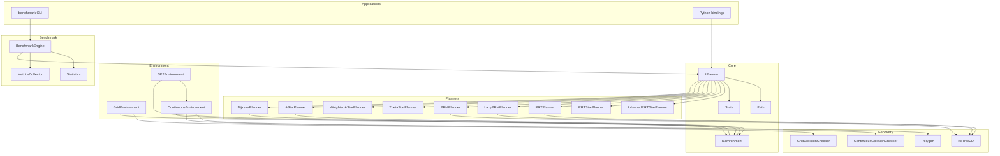

# Архитектурная диаграмма

```mermaid
graph TB
    subgraph "Applications"
        CLI[benchmark CLI]
        PY[Python bindings]
    end

    subgraph "Benchmark"
        BE[BenchmarkEngine]
        STAT[Statistics]
        MC[MetricsCollector]
    end

    subgraph "Planners"
        DIJ[DijkstraPlanner]
        ASTAR[AStarPlanner]
        WA[WeightedAStarPlanner]
        THETA[ThetaStarPlanner]
        PRM[PRMPlanner]
        LPRM[LazyPRMPlanner]
        RRT[RRTPlanner]
        RRTSTAR[RRTStarPlanner]
        IRRT[InformedRRTStarPlanner]
    end

    subgraph "Environment"
        GE[GridEnvironment]
        CE[ContinuousEnvironment]
        SE2[SE2Environment]
    end

    subgraph "Geometry"
        GCC[GridCollisionChecker]
        CCC[ContinuousCollisionChecker]
        KDT[KdTree2D]
        POLY[Polygon]
    end

    subgraph "Core"
        STATE[State]
        PATH[Path]
        IP[IPlanner]
        IE[IEnvironment]
    end

    CLI --> BE
    PY --> IP
    BE --> IP
    BE --> MC
    BE --> STAT

    IP --> DIJ
    IP --> ASTAR
    IP --> WA
    IP --> THETA
    IP --> PRM
    IP --> LPRM
    IP --> RRT
    IP --> RRTSTAR
    IP --> IRRT

    DIJ --> IE
    ASTAR --> IE
    GE --> IE
    CE --> IE
    SE2 --> IE

    GE --> GCC
    CE --> CCC
    CE --> POLY
    SE2 --> CE

    PRM --> KDT
    LPRM --> KDT
    RRT --> KDT

    IP --> STATE
    IP --> PATH
```
